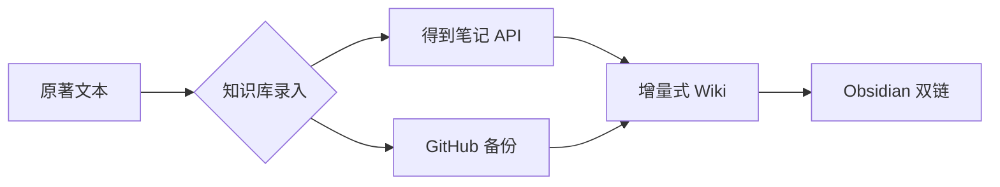

# Skill: knowledge-base-manager（知识库管理）

## 功能定位
管理有声漫画生产的知识库，记录原著细节、世界观、角色设定。

## 核心能力

| 能力 | 说明 |
|------|------|
| 双源数据 | 得到笔记 API [网络] + GitHub [网络] |
| 增量式 Wiki | 非传统 RAG，持久化知识库 |
| Obsidian 双链 | [[双向链接]] 格式支持 |
| 版本管理 | Git 版本控制 |
| 知识打磨 | 知识沉淀与优化 |

## 输入

```yaml
action: 查询|添加|更新|搜索
source: biji|github|local
query: <查询内容，可选>
content: <添加/更新内容，可选>
```

## 输出

```yaml
status: success
results: <查询结果>
source: <数据源>
format: markdown|obsidian
```

## 触发场景

| 场景 | 示例 |
|------|------|
| 查询知识库 | "查询角色设定" / "搜索世界观" |
| 更新经验 | "添加新角色" / "更新剧情设定" |
| 获取参考 | "获取参考资料" / "查询原著细节" |

## 数据结构

```
knowledge-base/
├── characters/       # 角色设定
│   ├── protagonist.md
│   └── antagonist.md
├── world/           # 世界观设定
│   ├── timeline.md
│   └── locations.md
├── plot/            # 剧情细节
│   └── chapters/
├── reference/       # 参考资料
│   └── sources.md
└── obsidian/        # Obsidian 格式备份
    └── .gitkeep
```

## 双源架构



## 增量式 Wiki 特点

| 传统 RAG | 增量式 Wiki |
|----------|-------------|
| 每次重新检索 | 持久化知识积累 |
| 无版本管理 | Git 版本控制 |
| 孤立片段 | 双向链接网络 |

## 参考资料

- Astro-Han/karpathy-llm-wiki（增量式 Wiki 架构）
- eugeniughelbur/obsidian-second-brain（Obsidian 双链）
- doc.biji.com（得到笔记 API）

## 验收标准

- [ ] 支持得到笔记 API 调用
- [ ] 支持 GitHub 备份
- [x] Obsidian 双链格式兼容（C23）
- [x] 增量式知识更新（JSONL 追加）
- [x] Git 版本控制
- [x] Rust 重写（C1）: kb-rust

## 代码入口

### Rust 工具（C1 优先）

```bash
# 位置
kb-rust/target/release/kb-rust --kb-dir knowledge-base <cmd>

# 命令
kb-rust init        # 初始化目录结构
kb-rust list        # 列出所有条目
kb-rust query <type>  # 按类型查询
kb-rust search <kw>   # 搜索名称/标签
kb-rust rebuild      # 从 Markdown 文件重建索引
kb-rust add <name> <type> <tags>  # 追加索引条目
```

### Python 脚本（备用）

`skills/knowledge-base-manager/scripts/kb-manager.sh`
